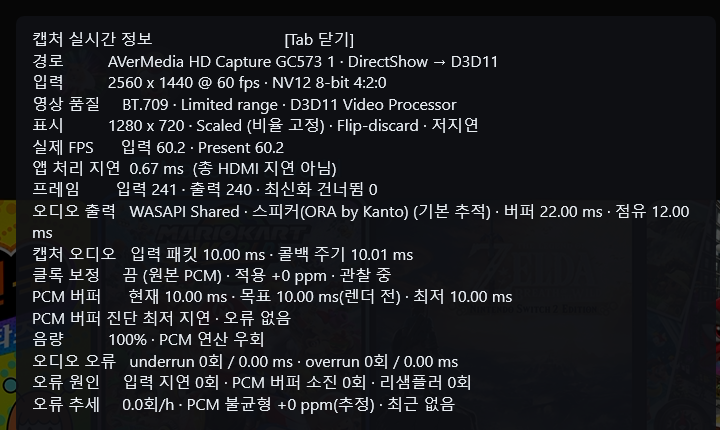

# Low Latency Capture Viewer

> [English](README.md) · [최신 릴리스](https://github.com/seria-aa/LowLatencyCaptureViewer/releases/latest)

Windows x64용 초저지연 HDMI 캡처 뷰어입니다. DirectShow 캡처카드에서 영상과
오디오를 직접 받아 D3D11로 영상을 표시하고 WASAPI로 오디오를 출력합니다.
AVerMedia GC573를 기준으로 개발·검증했습니다. 다른 DirectShow 캡처보드는
영상 필터와 오디오 필터가 분리된 USB 장치까지 실험적으로 지원합니다.

mpv, FFmpeg, 디코더, 별도 실행 파일은 필요하지 않습니다.

## 주요 기능

- 영상·오디오를 하나의 DirectShow 그래프에서 캡처. 분리된 USB 오디오 필터도
  자동 또는 수동으로 연결 가능
- 최신 프레임만 표시하고 지연을 만드는 오래된 프레임은 버림
- D3D11 Video Processor, flip-discard 스왑체인, 최대 프레임 지연 1
- 저지연 표시 또는 VSync 선택, 부드럽게/선명하게 화면 확대 방식
- WASAPI Shared(호환성 우선) / Exclusive(장치 독점·지연 최소화) 출력
  및 기본 장치 추적 또는 특정 장치 고정
- IAudioClient3 기반 Shared 저지연 period 협상 및 기존 WASAPI 자동 대체 경로
- PCM 안전 대기량과 클록 드리프트 보정을 독립적으로 설정
- 선택한 장치·해상도별 지원 모드를 자동 인식하고 픽셀 포맷·프레임을 선택
- 픽셀 퍼펙트 1:1, 비율 고정 창 크기 조절, 멀티 모니터 DPI, 가장자리 스냅
- Tab 실시간 정보창, 선택적 진단 로그, 볼륨 HUD, 백그라운드 자동 음소거

## 요구 사항

- Windows 10/11 x64
- DirectShow 캡처카드 드라이버
- progressive 비압축 NV12 또는 YUY2 영상 모드
- 같은 캡처 필터 또는 별도 DirectShow 오디오 입력 필터의 48 kHz 스테레오 PCM
- 비디오 장치와 별도 오디오 장치를 함께 쓸 경우, 장시간 사용에는 클록 드리프트
  보정 사용을 권장
- x64 릴리스 패키지는 Visual C++ Redistributable를 별도로 설치하지 않아도
  실행되도록 포함되어 있습니다.

GC573가 테스트·권장 장치입니다. 다른 장치는 실험적이며, 압축 포맷, P010,
자동 장치 재연결은 지원하지 않습니다.

## 설치 및 실행

1. `LowLatencyCaptureViewer_v1.0.4_Setup.exe`를 실행하고 설치합니다.
2. 시작 메뉴의 **Low Latency Capture Viewer** 또는 설치된 실행 파일을
   실행합니다.

포터블판 `LowLatencyCaptureViewer_v1.0.4_x64.zip`도 함께 제공합니다. 원하는
폴더에 압축을 풀고 `LowLatencyCaptureViewer.exe`를 실행하면 됩니다.

설정과 진단 로그는 사용자별로
`%LOCALAPPDATA%\\LowLatencyCaptureViewer`에 저장됩니다. 기존에 실행 파일 옆에
있던 `settings.ini`가 있으면 첫 실행 때 이 위치로 자동 복사하며 기존 파일은
삭제하지 않습니다. 제거 프로그램은 기본적으로 이 데이터를 보존하며, 제거
과정에서 삭제 여부를 묻습니다. **아니오**를 선택하면 다음 설치를 위해 설정과
진단 로그를 유지하고, **예**를 선택하면 영구적으로 삭제합니다.

앱 하나에 한국어·영어 UI가 함께 포함됩니다. 설정 창의 **언어 / Language**에서
자동(Windows 언어), 한국어, English를 선택할 수 있으며, 선택값은 사용자별로
저장됩니다. 별도 영어 실행 파일은 설치하지 않습니다.

## 권장 시작 설정

| 항목 | 권장 시작값 |
| --- | --- |
| 화면 표시 방식 | 최저 표시 지연은 저지연. 화면 경계를 맞추려면 VSync. |
| 오디오 모드 | Shared는 시스템과 공유해 호환성이 높고, Exclusive는 장치를 독점해 지연을 줄일 수 있습니다. |
| 출력 장치 | 고정 장치가 꼭 필요하지 않으면 Windows 기본 출력 장치 따라가기. |
| 클록 드리프트 보정 | 원본 PCM을 유지하려면 끔. 장시간 사용 중 관련 오류가 반복될 때만 켬. |
| PCM 버퍼 목표 | 최소 지연은 10 ms. underrun이 반복될 때만 올림. |
| 영상 포맷 | 최저 업로드 부하는 자동/NV12 우선. 120 fps가 유지되지 않으면 60 fps 선택. |
| 화면 확대 방식 | 기본은 부드럽게. Pixel-perfect를 끈 전체화면이 흐리면 선명하게를 시도. |

캡처 장치나 해상도를 바꾸면 지원하는 픽셀 포맷과 프레임 목록을 다시 읽습니다.
설정 창을 다른 모니터로 옮기면 모니터 경계를 넘는 순간 권장 캡처 해상도도
따라갑니다(FHD에서는 1920x1080, 그 이상에서는 QHD). 이때 지원 포맷·프레임
목록을 한 번 갱신하지만 설정 창에서만 동작하므로 실행 중 캡처·렌더링 경로의
성능이나 지연에는 영향을 주지 않습니다. 지원하는 비압축 모드가 없으면
시작할 수 없습니다.

`캡처 오디오 장치`는 기본적으로 영상 장치 안의 오디오 핀을 우선 사용합니다.
USB 캡처보드처럼 오디오가 별도 DirectShow 장치로 나타나는 경우에는 이름이
일치하는 입력을 자동으로 찾습니다. 자동 선택에 실패하면 목록에서 해당 USB 오디오
입력을 직접 고르세요. 오류 로그에는 실패 단계와 각 필터의 핀·미디어 타입이 기록됩니다.

이 프로그램에서는 **NV12를 저지연 권장 포맷**으로 사용합니다. NV12는 픽셀당
12비트, YUY2는 픽셀당 16비트이므로 남아 있는 시스템 메모리→D3D11 업로드에서
NV12가 프레임 데이터를 25% 적게 전송해 일반적으로 대역폭과 처리 지연에
유리합니다. 두 포맷 모두 이후에는 동일한 최신 프레임 전용 D3D11 Video
Processor 경로를 사용합니다. 실제 차이는 캡처 장치와 드라이버에 따라 달라질 수
있으므로, 4:2:2 색 정보가 더 중요하거나 특정 장치가 YUY2를 더 잘 처리할 때는
YUY2를 선택하세요.

`Pixel-perfect`를 켜면 선택한 캡처 해상도와 같은 1:1 클라이언트 영역으로
고정되고 마우스 크기 조절이 꺼집니다. 해제하면 영상 비율을 유지한 채 창 크기를
조절할 수 있습니다. 모니터 이동 시 상대적 창 크기 유지는 독립 옵션이며, 켜져
있으면 저장된 상대 비율을 다음 실행에도 적용합니다. 따라서 4K에서 QHD 창을
FHD로 옮긴 뒤 종료해도 FHD에서 다시 QHD 전체 크기로 열리지 않습니다.

`화면 확대 방식`은 1:1이 아닌 확대에만 영향을 줍니다. **부드럽게**는 기본
보간 방식이고, **선명하게**는 GPU Video Processor가 지원할 때 가장자리 보강을
적용합니다. 프레임 큐를 추가하지 않으므로 표시 지연을 늘리지 않으며, 확대된
글자나 UI를 더 또렷하게 보이게 할 수 있습니다. 다만 정수배가 아닌 확대를
완전한 Pixel-perfect로 바꾸지는 못합니다. GPU 드라이버가 지원하지 않으면
안전하게 부드럽게 방식으로 동작합니다.

시작하기 전에 OBS Studio, 제조사 캡처 유틸리티(예: Elgato 4K Capture Utility)
등 캡처보드를 이미 사용 중인 프로그램을 종료하세요. 지원되는 모드를 골랐어도
장치를 다른 프로그램이 점유하면 캡처 초기화가 실패할 수 있습니다.

## 저지연 오디오

**WASAPI Shared**를 고르면 설정 창에서 선택한 출력 장치의 `IAudioClient3`
지원 여부를 확인합니다. 지원되는 경우 장치가 실제 제공하는 Shared 엔진 period를
읽고, 그중 요청값에 가장 가까운 유효 저지연 period로 event-driven
`InitializeSharedAudioStream`을 시작합니다. 5ms나 10ms를 무조건 사용할 수
있다고 가정하지 않으며, 지원 범위는 설정 창에, 실제 적용 period는 Tab 정보창에
표시됩니다.

해당 장치나 PCM 형식에서 `IAudioClient3`를 쓸 수 없으면 기존 WASAPI Shared
방식으로 자동 전환합니다. Exclusive는 별도의 장치 직접 출력 모드이며,
`IAudioClient3` 사용 여부와는 독립적입니다.

## 조작법

| 조작 | 기능 |
| --- | --- |
| `F11` | borderless 전체화면 전환 |
| `Tab` | 실시간 정보창 표시/숨기기 |
| 영상 위 마우스 휠 | 애플리케이션 볼륨을 5% 단위로 조절 |
| 창을 가장자리·모서리로 드래그 | 창 크기 변경 없이 스냅 |
| `Shift` + 드래그 | 일시적으로 스냅 무시 |
| `Esc` | 전체화면 해제. 창 모드에서 다시 누르면 종료 |

## 실시간 정보창(OSD)

Tab 정보창에는 입력/Present FPS, 앱 처리 시간, 버린 프레임, 실제 선택된 포맷,
WASAPI 버퍼 상태, PCM 대기량, 클록 보정, underrun/overrun 횟수가 표시됩니다.
통계는 시작 후 2초 워밍업 뒤부터 집계하지만, 캡처와 오디오 출력은 즉시 시작됩니다.



*Tab 진단 오버레이 예시입니다. 수치는 장치·모니터·드라이버에 따라 달라집니다.*

ppm 값은 하드웨어 클록을 직접 측정한 결과가 아니라 스케줄링 지연과 시작 구간도
포함한 동작상 추정값입니다. 클록 보정 여부는 10~30분 관찰 후 판단하세요.

OSD 용어:

- **출력 버퍼**: WASAPI 장치 버퍼
- **출력 점유**: 그 장치 버퍼에 현재 들어 있는 오디오 양
- **PCM 버퍼**: 캡처와 재생 사이의 프로그램 내부 안전 큐

가끔 한 번 발생한 underrun은 곧바로 소리 문제를 뜻하지 않습니다. 반복된다면,
원본 PCM 보존이 우선일 때는 리샘플링보다 먼저 PCM 버퍼 목표를 올리세요.

## 호환성과 사용 팁

### OBS와의 차이

OBS Studio는 장면 구성, 녹화, 방송, 필터, 플러그인, 인코딩을 위한 범용
제작 도구입니다. 이 프로그램은 전용 프리뷰 경로로, 장면을 합성하거나 녹화·
인코딩하지 않고 FFmpeg/mpv도 필요로 하지 않습니다. 따라서 프리뷰 지연과
동작 예측 가능성이 중요한 경우 경로가 단순하지만, OBS의 성능을 수치로
대체하거나 OBS를 대체하는 프로그램은 아닙니다. 방송·녹화 기능이 필요하면 OBS를
사용하세요.

### WASAPI Exclusive와 시스템 DSP

Equalizer APO, HeSuVi 등 Windows 전체에 적용한 APO/DSP·공간 음향을 계속
사용해야 한다면 **WASAPI Shared**를 선택하세요. **WASAPI Exclusive**는 출력
장치를 직접 열어 공유 믹서 경로를 줄일 수 있지만, 일반적으로 Shared 모드용
APO/DSP 효과를 우회하고 해당 장치를 다른 앱과 동시에 사용할 수 없습니다.
호환성과 최소 오디오 경로 지연 중 우선순위에 따라 선택하면 됩니다.

### 주사율이 다른 모니터를 함께 사용할 때

창 모드에서 75/100/144Hz처럼 주사율이 다른 모니터를 오가면 Windows DWM 합성
때문에 프레임 페이싱이 달라지거나 미세한 스터터링이 보일 수 있습니다. 저지연
표시는 추가 VSync 대기를 생략해 지연을 줄이는 대신 찢어짐이 생길 수 있지만,
DWM 때문에 생기는 모든 페이싱 차이까지 없애지는 않습니다. VSync는 찢어짐을
줄이는 대신 한 주기만큼 기다릴 수 있으며 현재 모니터의 합성 상태에 영향을
받습니다. 캡처 FPS는 먼저 입력 소스가 지원하는 범위 안에서 고르고, 그 안에서
가능하면 대상 모니터와 균일한 주기를 이루는 값을 선택하세요. 창을 옮긴 뒤에는
Tab의 입력 FPS·Present FPS를 비교하세요.

### 캡처 프레임

캡처 프레임은 입력 소스가 실제로 낼 수 있는 최대 프레임 이하로 고르세요.
모니터 주사율보다 이 입력 한도가 우선입니다. 120fps 입력을 144fps로 캡처해도
새로운 영상 정보는 생기지 않으며, 캡처카드는 같은 프레임을 반복하거나 타이밍을
변환할 뿐입니다. 따라서 144Hz 모니터를 쓴다고 144fps 캡처가 필요한 것은
아닙니다. 120fps 입력에는 120fps, 60fps 입력에는 60fps를 사용하세요. 소스가
여러 프레임 속도를 제공한다면 그중 대상 모니터와도 균일한 주기를 이루는 값을
고르면 됩니다(예: 120fps와 120/240Hz). VSync 사용 시 120fps 영상은 144Hz보다
120Hz 또는 240Hz 모니터에서 더 균일한 프레임 페이싱을 기대할 수 있습니다.

### 리소스와 입력 지연에 대한 해석

인코더·장면 그래프·영상 큐를 두지 않고 최신 프레임만 유지하므로 불필요한
처리 단계가 적습니다. 다만 CPU/GPU 사용률은 해상도, FPS, 드라이버, 모니터와
바탕화면 합성에 따라 달라지므로 특정 PC의 고정 퍼센트를 보장하지 않습니다.
OSD의 앱 처리 지연도 HDMI 전체 또는 모니터 지연이 아닙니다. osu!, DJMAX 같은
리듬 게임처럼 시간에 민감한 용도는 실제 사용할 캡처카드와 모니터 조합에서
직접 확인하는 것이 좋습니다.

## 소스에서 빌드

Visual Studio 2022 x64 개발자 PowerShell에서 실행합니다.

```powershell
cmake -S . -B build -A x64
cmake --build build --config Release
```

생성 파일은 `build\Release\LowLatencyCaptureViewer.exe`입니다.

설치 프로그램 스크립트는 `installer\LowLatencyCaptureViewer.iss`이며 Inno Setup
6 이상으로 빌드합니다. 설치판과 포터블판 모두 컴퓨터별 설정 파일은 포함하지
않습니다.

## 라이선스

Copyright (C) 2026 seria-aa. 이 프로젝트는
[GNU General Public License v3.0 또는 이후 버전](LICENSE)으로 배포됩니다.
Windows 구성요소와 캡처카드 드라이버는 별도 구성요소이며 각자의 라이선스를
따릅니다.
