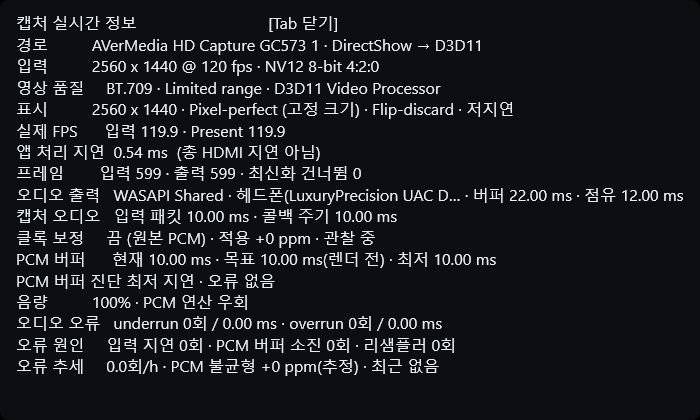

# 실시간 정보창과 로그

> [English](DIAGNOSTICS.md) · [README로 돌아가기](../README.ko.md)

뷰어에서 `Tab`을 누르면 실시간 정보창을 표시하거나 숨길 수 있습니다.



## 영상 항목

- **경로:** 선택한 캡처 장치와 DirectShow→D3D11 경로
- **입력:** 실제 해상도, FPS와 픽셀 포맷
- **영상 품질:** 색 범위와 D3D11 처리 경로
- **표시:** 출력 크기, 확대 방식, 스왑체인과 표시 모드
- **실제 FPS:** 측정한 입력·Present 속도
- **앱 처리 지연:** 앱 내부에서 걸린 시간이며 HDMI 전체 지연은 아님
- **프레임:** 입력, 출력, 최신화 교체 또는 버린 횟수

이전 프레임을 표시하기 전에 새 샘플이 들어오면 최신화 교체가 발생할 수 있습니다.
숫자가 증가한다고 앱이 지연을 쌓는다는 뜻은 아닙니다. 오히려 대기열을 막기 위해
오래된 샘플을 버리는 동작입니다.

영상 통계는 시작 후 첫 2초를 집계에서 제외합니다.

## 오디오 항목

- **오디오 출력:** WASAPI 모드, 출력 버퍼와 현재 점유량
- **캡처 오디오:** 입력 패킷 크기와 콜백 간격
- **클록 보정:** 사용 여부와 적용 중인 속도 보정량
- **PCM 버퍼:** 현재, 목표와 관측한 최소 대기량
- **오디오 오류:** underrun/overrun 횟수와 지속 시간
- **오류 원인·추세:** 최근 진단과 장시간 불균형 추정값

오디오 오류 진단은 시작 후 첫 5초를 집계에서 제외합니다. 캡처와 재생을 5초 뒤에
시작하는 것이 아니라 통계만 워밍업을 기다립니다.

ppm은 하드웨어 클록을 직접 측정한 값이 아니라 동작상 추정값입니다. 시작 구간과
스케줄링 지연에도 영향을 받으므로 ppm만 보고 보정을 켜기 전에 안정된 상태로
10~30분 관찰하세요.

## 버퍼 용어

- **출력 버퍼:** WASAPI 출력 장치 버퍼
- **출력 점유:** 출력 장치 버퍼에 현재 들어 있는 오디오
- **PCM 버퍼:** 캡처와 재생 사이의 앱 내부 안전 대기열

서로 다른 값입니다. PCM 목표를 올리면 앱의 오디오 대기량이 늘고, WASAPI 요청을
바꾸면 출력 장치 쪽 period 또는 버퍼에 영향을 줍니다.

가끔 한 번 발생한 underrun은 반드시 들리는 문제이거나 치명적인 오류라는 뜻은
아닙니다. 반복된다면 먼저 출력 장치가 안정적인지 확인하고 PCM 목표를 한 단계
올리세요. 클록 보정은 일시적인 스케줄링 중단이 아니라 한 방향으로 계속 커지는
드리프트가 관측될 때 사용합니다.

## 로그 파일

고급 설정에서 **진단 로그 파일 저장**을 켜면 다음 위치에 기록됩니다.

```text
%LOCALAPPDATA%\LowLatencyCaptureViewer\logs
```

선택한 장치와 모드, 실제 allocator 크기, WASAPI 초기화와 대체 경로, 캡처 그래프
진행 단계가 기록됩니다. 초기화에 실패하면 필터의 핀과 미디어 타입 정보도 함께
남깁니다.

저장 로그는 자동으로 제한됩니다. 파일 한 개는 최대 2 MB이며, 최신 관리 대상 로그
최대 5개와 총 10 MB까지만 유지합니다. 7일이 지난 관리 대상 로그는 새 로그 세션을
시작할 때 정리됩니다. 오래 실행하면 `..._part02.log`처럼 나뉠 수 있으니 문제를
제보할 때는 같은 세션의 모든 part 파일을 함께 첨부해 주세요.

**진단 콘솔 창 표시**는 같은 진단 출력을 콘솔에서 실시간으로 보여줍니다. 기본은
꺼짐이며, 콘솔을 켜지 않아도 파일 로그 저장에는 지장이 없습니다.

문제를 제보할 때는 전체 로그와 함께 캡처보드 모델, 입력 해상도/FPS, 선택한 픽셀
포맷, 캡처 오디오 장치와 출력 장치를 알려주세요.
