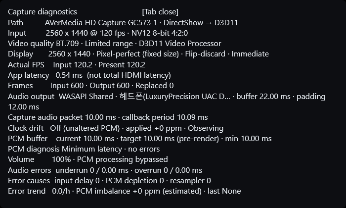

# Diagnostics and logs

> [한국어](DIAGNOSTICS.ko.md) · [Back to README](../README.md)

Press `Tab` in the viewer to show or hide the diagnostics overlay.



## Video fields

- **Path:** selected capture device and DirectShow-to-D3D11 path
- **Input:** active resolution, FPS, and pixel format
- **Quality:** color range and D3D11 processing path
- **Display:** output size, scaling mode, swapchain, and presentation mode
- **Actual FPS:** measured Input and Present rates
- **App processing latency:** time inside the application, not total HDMI latency
- **Frames:** captured, presented, replaced, or discarded counts

Latest-frame replacement is expected when capture produces a newer sample before
the previous one is presented. A rising count does not automatically mean the
viewer is accumulating latency; the old sample is being discarded specifically
to prevent that queue.

Video statistics exclude the first two seconds after startup.

## Audio fields

- **Audio output:** WASAPI mode, endpoint buffer, and current occupancy
- **Capture audio:** packet size and callback interval
- **Clock correction:** enabled state and applied rate adjustment
- **PCM buffer:** current, target, and observed minimum queue depth
- **Audio errors:** underrun and overrun counts and durations
- **Cause/trend:** recent diagnosis and estimated long-term imbalance

The first five seconds are excluded from audio error diagnostics. Capture and
playback still begin immediately; only the statistics wait for warmup.

The ppm value is an operational estimate rather than a direct hardware-clock
measurement. Startup and scheduling stalls can affect it. Observe a stable
session for 10–30 minutes before enabling drift correction solely from ppm.

## Buffer terminology

- **Output buffer:** the WASAPI endpoint buffer
- **Output occupancy:** audio currently queued in the endpoint
- **PCM buffer:** the application's capture-to-render safety queue

These are separate. Raising the PCM target adds application audio queueing;
changing the WASAPI request affects the output endpoint.

An occasional underrun is not necessarily audible or harmful. If underruns
repeat, first confirm that the output device is stable, then raise the PCM target
one step. Enable clock correction only for a persistent drift pattern rather
than an isolated scheduling interruption.

## Log files

Enable **Save diagnostic log file** in advanced settings. Logs are written to:

```text
%LOCALAPPDATA%\LowLatencyCaptureViewer\logs
```

The log records selected devices and modes, actual allocator sizes, WASAPI
initialization, fallback paths, capture-graph stages, and filter pin/media-type
details after an initialization failure.

Saved logs are automatically bounded: each part is limited to 2 MB, and the
newest five managed log files are retained up to a combined 10 MB. Managed logs
older than seven days are removed when a new logging session starts. A long
session may create `..._part02.log`; attach every part from that session when
reporting a problem.

**Show diagnostic console** displays the same live diagnostic output in a
console window. It is disabled by default and is not required for file logging.

When reporting a problem, include the complete log and state the capture device,
source resolution/FPS, selected pixel format, capture audio device, and output
audio device.
